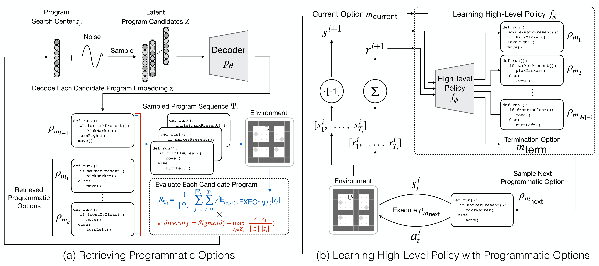

# Hierarchical Programmatic Option Framework

This repository contains the implementation code for [**Hierarchical Programmatic Option Framework**](https://openreview.net/pdf?id=FeCWZviCeP), which is published in [**NeurIPS 2024**](https://neurips.cc/Conferences/2024/).


Neural network policies learned by deep RL methods are difficult to interpret and often struggle to generalize to novel scenarios. To address this issue, prior works proposed to use human-readable programs as policies to increase the interpretability of the decision-making pipeline. Nevertheless, programmatic policies generated by these methods struggle to effectively solve long and repetitive RL tasks and cannot generalize to even longer horizons during testing. To solve these problems, we propose the **Hi**erarchical **P**rogrammatic **O**ption framework (**HIPO**), which aims to solve long and repetitive RL problems with human-readable programs as options (low-level policies). Specifically, we propose a method that retrieves a set of effective, diverse, and compatible programs as options. Then, we learn a high-level policy to effectively reuse these programmatic options to solve reoccurring subtasks. 


<p align="center">
    
</p>

To evaluate the performance of our proposed framework and its generalization ability to even longer horizons, we adopt the Karel domain and design a new set of Karel tasks consisting of an arbitrary number of subtasks (i.e., the Karel-Long problem set). HIPO outperforms prior programmatic reinforcement learning and deep RL baselines on existing benchmarks and shows better generalization in testing environments of different lengths.

## Environments

### Karel and Karel-Hard problem sets
- The code for the Karel problem set can be found in [leaps/karel_env](https://github.com/clvrai/leaps/tree/d89beb11d1c9e1845f61c3a58e69e9c3f2672c39/karel_env).
- As for the Karel-Hard problem set, you can find the implementation code in [HPRL/karel_env](https://github.com/NTURobotLearningLab/HPRL/tree/6690f3f29b2ac55188ab8aead202b425ea87636d/karel_env).


### Karel-Long problem set
Since most of the tasks in the Karel and Karel-Hard problem sets are short-horizon and insufficient for evaluating long-horizon task-solving capabilities, the Karel-Long problem set is introduced to benchmark the capability of HIPO. The implementation code can be found in [karel_long_env](./karel_long_env/).


## Getting Started 

- [Python 3.9](https://www.python.org/downloads/release/python-390/)
- CUDA 11.6, compatible with Linux x86_64 Driver Version ≥ 510.39.01.
- Create a virtual environment, activate it and install the packages specified in [`requirements.txt`](requirements.txt).


```
conda create --name prl python=3.9  # create env named 'prl' with Python 3.9
conda activate prl                 # activate the environment
pip3 install torch torchvision torchaudio --extra-index-url https://download.pytorch.org/whl/cu116  # install PyTorch with CUDA 11.6
pip3 install -r requirements.txt   # install additional dependencies
```


## Usage

### HIPO: A Three-Stage Framework

### Stage 1: Constructing a program embedding space

We adopt the approach outlined in [LEAPS](https://clvrai.github.io/leaps/) to learn the program embedding space used in HIPO. The pre-trained model weights for the program embedding space can be found at `/leaps/weights/LEAPS/best_valid_params.ptp`. These weights include those for the program encoder $q_{\psi}$, which encodes a program as a latent program, and for the corresponding program decoder $p_{\theta}$, which decodes the latent program back into a reconstructed program. If you would like to train an additional model, please refer to the instructions under "Stage 1: Learning Program Embeddings" in the "LEAPS Training" section of the [leaps](https://github.com/clvrai/leaps/tree/d89beb11d1c9e1845f61c3a58e69e9c3f2672c39) repository. If not, you may proceed directly to our Stage 2 instructions.


### Stage 2: Retrieving programmatic options

To retrieve effective, diverse, and compatible programmatic options for a specific Karel-Long task (as described in Section 4.2.3 of the paper), run the following shell command from within the `hipo/` directory:

```bash
sh shell/{task_name}_cem.sh
```
Here, `{task_name}` can be one of the following: `seesaw`, `upNdown`, `farmer`, `infinite_doorkey` or `infinite_harvester`. This process performs search and evaluation using the CEM+diversity+compatibility strategy, and generates candidate programs suitable for high-level policy selection. Conceptually, `shell/{task_name}_cem.sh` invokes `shell/cem_hipo_template.sh`, which serves as a template script for conducting CEM+diversity+compatibility search.


- Selected arguments (see the `config_cem.py` configuration file for more details):
    - Checkpoints: 
        - --net.saved_params_path: specify the path to a pre-trained checkpoint; load pre-trained parameters (e.g. `leaps/weights/LEAPS/best_valid_params.ptp`). If you trained your own Stage 1 model, redirect this argument to `best_valid_params.ptp` of that model.
    - Our CEM (with diversity and compatibility) hyperparameters:
        - --CEM.max_number_of_epochs: specifies the maximum number of iterations (epochs) the CEM algorithm will run during searching
        - --CEM.population_size: number of candidate programs sampled in each epoch
        - --CEM.sigma: the standard deviation used in the Gaussian sampling distribution to perturb the program vectors
        - --CEM.elitism_rate: the proportion of top-performing candidates (elites) selected to influence the next generation
        - --CEM.init_type: the strategy used to initialize the program vectors, i.e., sampling from ['normal':N(0,1), 'tiny_normal':N(0,0.1), 'ones':N(1, 0)]
        - --CEM.use_exp_sig_decay: boolean variable to indicate exponential decay in sigma
        - --CEM.early_stop_std: the threshold on the standard deviation of recent rewards below which early stopping is triggered
        - --CEM.vertical_similarity: if `True`, previously found programs are added to the diversity pool to guide future generations
        - --CEM.random_seq: path to a file specifying each corresponding program list $\Psi_i$ used during the program evaluation process described in Section 4.2.3 of the paper
        - --CEM.diversity_vector: path to a file containing program vectors used for diversity calculation
        - --CEM.compatibility_vector: path to a file containing program vectors used for compatibility calculation
    - Task-specific arguments:
        - --height: the height of the Karel grid environment for the specified task
        - --width: the width of the Karel grid environment for the specified task


### Stage 3: Learning high-level policy with programmatic options

To learn the high-level policy with the programmatic options found in Stage 2, run the following shell command from within the `hipo/` directory:

```bash
sh shell/{task_name}_high_level_policy.sh
```

Here, again, `{task_name}` can be one of the following: `seesaw`, `upNdown`, `farmer`, `infinite_doorkey` or `infinite_harvester`. The policy training process uses PPO to optimize a neural network that maps Karel state observations to the next programmatic option for execution. Convolutional layers are used to extract spatial features from the input gridworld states, while fully connected layers predict the next program to execute. 


## Authors

[Yu-An Lin](https://github.com/AndyLinGitHub), [Chen-Tao Lee](https://boris-ctl.github.io/), [Chih-Han Yang](https://github.com/CHYang25), [Guan-Ting Liu](https://dannyliu15.github.io/), [Shao-Hua Sun](https://shaohua0116.github.io/)
